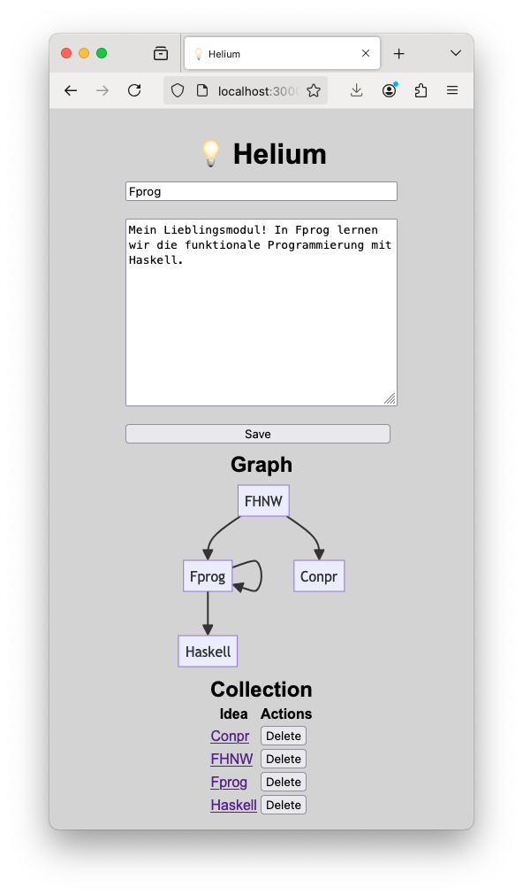
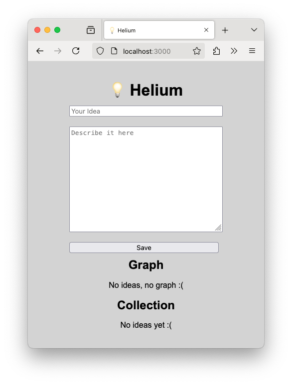

# fprog Programmierprojekt HS24

## Thema
In diesem Programmierprojekt implementieren Sie eine leichtgewichtige Ideenverwaltung namens `Helium`.


<p>Abbildung 1: Startseite</p>


<p>Abbildung 2: Leere Startseite</p>


## Rahmenbedingungen
- Dieses Projekt ist eine **Einzelarbeit**. Gemäss Prüfungsordnung führt ein Verstoss gegen diese Bedingung zur **Note 1**.
- Das Projekt muss im bereitgestellten Dev-Container gebaut werden können.
- Es dürfen keine zusätzlichen Libraries im `helium.cabal` unter `build-depends` hinzugefügt werden.
- Fragen schicken Sie per Mail an `daniel.kroeni@fhnw.ch`. Ich werde dann die Frage und die Antwort auf MS Teams publizieren, damit alle dieselben Informationen haben.
- Github Copilot, ChatGPT, etc. dürfen verwendet werden. Ihr Verständnis des Codes wird aber auch bewertet.

## Spezifikation der Anwendung
Dieses [Video](https://tube.switch.ch/videos/OwfkyPyfe4) spezifiziert die Funktionalität der Applikation. Es ist somit Teil der Spezifikation. Schauen Sie es sich unbedingt an!

### HTTP Routen
- **Startseite:** GET http://localhost:3000/
- **Startseite mit existierender Idee:** GET http://localhost:3000/he/Fprog
- **Idee speichern:** POST http://localhost:3000/he/save (im Body unter dem `formParam "idea"` wird der Identifier und unter `formParam "content"` die Beschreibung der Idee erwartet). Danach wird auf die Startseite umgeleitet (`redirect`).
- **Idee löschen:** POST http://localhost:3000/he/Fprog/delete. Danach wird auf die Startseite umgeleitet (`redirect`).


### Datenhaltung
Jede Idee wird als separate Datei im [`ideas/`](ideas/) Ordner abgelegt. 
- Der Name einer Idee entspricht dabei dem Dateinamen. Wir gehen davon aus, dass die Namen der Ideen jeweils aus einem einzigen Wort bestehen und keine Sonderzeichen enthalten.
Die Dateinamen haben keine Dateiendung. 
- Der Inhalt der Datei ist die Beschreibung der Idee.

Initial sind vier Ideen vorhanden: `FHNW`, `Fprog`, `Haskell` und `Conpr`. Eine identische Kopie der vier Ideen befindet sich im Ordner [`demo-ideas/`](demo-ideas/). Diese Dateien können Sie verwenden, um die Applikation zu testen.

## Aufgabe
Implementieren Sie die beschriebene Applikation.

## **Bewertung**
Zur Bewertung der Arbeit werden Kriterien zu **funktionalen** und **nicht-funktionalen** Anforderungen sowie zur **Selbstbeurteilung** herangezogen.

Grundsatz: Die folgenden Kriterien richten sich an angehende Software-Ingenieur*innen. Ich gehe davon aus, dass wir in den Grundsätzen ein gemeinsames Verständnis davon haben, was sinnvoll ist und was nicht. Es geht nicht darum, ein Schlupfloch in der Formulierung zu finden, sondern darum, eine sinnvolle Lösung zu erstellen.

⚠️ Wichtig! Die Kriterien sind **Alles oder Nichts**. Halb erfüllte Kriterien geben 0 Punkte.

Es gibt aber keine Punkte für _fake_ Lösungen. HTML, das statisch und nicht basierend auf den Dateien gebaut wird, gibt keine Punkte.

### **Funktionale Anforderungen (12 Punkte)**

#### **(F1) Empty Form - Ansicht (1Pt)**
Auf der [Homepage](http://localhost:3000/) wird der Titel "Helium" und ein Formular angezeigt.
Das Formular hat folgende Elemente:
- Ein Textfeld für den Namen der Idee.
- Ein Textfeld für die Beschreibung der Idee.
- Ein "Save" Button.


#### **(F2) Empty Form - Funktionalität (1Pt)**
Wenn das Formular ausgefüllt und der "Save" Button gedrückt wird, wird die Idee in einer Datei im `ideas/` Ordner gespeichert. Der Name der Datei entspricht dem Namen der Idee. Die Datei hat keine Dateiendung.

**Test:** 
1. Alle Dateien im `ideas/` Ordner löschen.
2. Homepage im Browser öffnen.
3. Formular ausfüllen:
    - Name: `Fprog`
    - Beschreibung: `Funktionale Programmierung`
4. Save Button drücken.
5. Überprüfen, ob die Datei `ideas/Fprog` existiert und ob der Inhalt korrekt ist.


#### **(F3) Edit Form - Ansicht (1Pt)**
Wenn eine Idee bereits existiert und in der URL angegeben wird, wird die Idee (Name und Beschreibung) im Formular angezeigt.

**Test:**
1. Sicherstellen, dass die Datei `ideas/Fprog` existiert und einen Inhalt hat.
2. [http://localhost:3000/he/Fprog] im Browser öffnen.
3. Überprüfen, ob die Idee im Formular angezeigt wird.


#### **(F4) Edit Form - Funktionalität (1Pt)**
Wenn eine Idee bereits existiert und im Formular dargestellt wird, kann die Beschreibung geändert und gespeichert werden. Die zugehörige Datei wird dabei überschrieben.

**Test:**
1. Sicherstellen, dass die Datei `ideas/Fprog` existiert und einen Inhalt hat.
2. [http://localhost:3000/he/Fprog] im Browser öffnen.
3. Im Formular sicherstellen, dass der Name `Fprog` und irgendeine Beschreibung angezeigt wird.
4. Beschreibung ändern auf "Super Sache" und speichern.
5. Überprüfen, ob die Datei `ideas/Fprog` existiert und ob der Inhalt korrekt überschrieben wurde.


#### **(F5) Collection - Ansicht (1Pt)**
Auf der Homepage gibt es einen Titel `Collection` und eine Liste mit allen Ideennamen.

**Test:**
1. Den `ideas` Ordner leeren und mit den Demodaten neu füllen.
2. Homepage im Browser öffnen.
3. Überprüfen, ob alle Ideennamen korrekt angezeigt werden.
4. Den Dateinamen einer Idee ändern, die Seite neu laden und überprüfen, ob die Änderung sichtbar ist.


#### **(F6) Collection - Link (1Pt)**
Die Ideennamen in der Liste sind klickbare Links mit dem korrekten Target `http://localhost:3000/he/<IDEA_NAME>`.

**Test:**
1. Den `ideas` Order leeren und mit den Demodaten neu füllen.
2. Homepage im Browser öffnen.
3. Auf den Link der `FHNW` Idee klicken. Dabei sollte die URL auf `http://localhost:3000/he/FHNW` umgeleitet werden.


#### **(F7) Collection - Delete (1Pt)**
Neben jedem Namen in der Collection Liste gibt es einen Button mit dem Text `delete`. Wenn dieser Link geklickt wird, wird die entsprechende Idee gelöscht und auf die Homepage umgeleitet. Die Datei wird dabei aus dem `ideas/` Ordner gelöscht.

**Test:**
1. Den `ideas` Ordner leeren und mit den Demodaten neu füllen.
2. Homepage im Browser öffnen.
3. Neben der `FHNW`-Idee Auf den Delete-Button drücken.
4. Überprüfen, ob die Datei `ideas/FHNW` nicht mehr existiert und ob die Seite neu geladen wird.
Auf der Homepage wird die Idee nicht mehr angezeigt.


#### **(F8) Collection Leer - Ansicht (1Pt)**
Wenn keine Ideen vorhanden sind, wird unter dem Titel `Collection` ein Hinweis angezeigt, dass keine Ideen vorhanden sind.

**Test:**
1. Den `ideas` Ordner leeren.
2. Homepage im Browser öffnen.
3. Überprüfen, ob der Hinweis dargestellt wird.


#### **(F9) Graph - Ansicht (2Pt)**
Auf der Homepage gibt es den Titel `Graph` und es wird ein Graph der Ideen angezeigt. Die Ideen sind dabei als Knoten dargestellt und die Verbindungen als Kanten. Die Ideen sind dabei mit den Namen der Dateien im `ideas/` Ordner identifiziert.
Jede Idee wird als Knoten dargestellt. Wenn die Beschreibung der Idee `A` den Namen einer anderen Idee `B` (oder auch sich selbst) enthält, wird eine Kante von `A` zu `B` dargestellt.

**Test:**
1. Den `ideas` Ordner leeren und mit den Demodaten neu füllen.
2. Homepage im Browser öffnen.
3. Überprüfen, ob der Graph korrekt dargestellt wird.
   - 4 Ideen `FHNW`, `Fprog`, `Haskell` und `Conpr` sind vorhanden.
   - `FHNW` hat Verbindungen zu `Fprog` und `Conpr`.
   - `Fprog` hat eine Verbindung zu `Haskell` und zu sich selbst.
4. Die Datei `ideas/FHNW` öffnen und den Text "Haskell für Alle" hinzufügen und speichern.
5. Die Seite neu laden und überprüfen, ob die zusätzliche Verbindung von `FHNW` zu `Haskell` korrekt dargestellt wird.


#### **(F10) Graph Leer - Ansicht (1Pt)**
Wenn keine Ideen vorhanden sind, wird unter dem Titel `Graph` ein Hinweis angezeigt, dass keine Ideen vorhanden sind.

**Test:**
1. Den `ideas` Ordner leeren.
2. Homepage im Browser öffnen.
3. Überprüfen ob unter dem Titel Graph ein Hinweis angezeigt wird.


#### **(F11) Graph - Links (1Pt)**
Die Knoten im Graph sind klickbar und führen auf die entsprechende Idee.

**Test:**
1. Den `ideas` Ordner leeren und mit den Demodaten neu füllen.
2. Homepage im Browser öffnen.
3. Auf den Knoten `FHNW` klicken. Dabei sollte die URL auf `http://localhost:3000/he/FHNW` umgeleitet werden.


### **Nicht Funktionale Anforderung (2 Punkte)**

#### **(NF1) Module (1Pt):**
Der Code muss in mindestens 3 Module aufgeteilt sein. 
Folgende abgegebebe Module werden dabei nicht mitgezählt: 
- `app/Main.hs`
- `test/HeliumTest.hs`
- `test/SelfAssessment.hs`

Alle Module im `lib`-Ordner zählen (auch das `Html` und das `Web` Modul).

Zudem muss die Persistenz (Filesystem Interaktion) in einem einzigen separaten Modul implementiert sein.

**Test:**  
Nur ein einziges Modul verwendet Funktionalität um mit dem Dateisystem zu interagieren. Nur dieses Modul darf `System.Directory` importieren und Funktionen wie `readFile`, `writeFile`, `appendFile` und `deleteFile` verwenden.

Die Scotty Funktion `file` ist eine Ausnahme und muss nicht zwingend in das Storage Modul, darf aber.

#### **(NF2) 0 Warnungen (1Pt):**
Beim Build dürfen keine Warnungen betreffend ihres Codes ausgegeben werden.

**Test:** 
1. Führen Sie `cabal clean` aus, damit im nächsten Schritt alles neu gebaut wird. 
2. Führen Sie `cabal build` aus. Es darf keine Warnung ausgegeben werden.

Wenn auch nur eine Warnung ausgeben wird, gibt es 0 Punkte.

Es geht um Warnungen, die der Compiler in Ihrem Code findet.  
Linker Warnung werden nicht gezählt. Beispiel: "ld: warning: -single_module is obsolete"


### **Selbstbeurteilung (5 Punkte)**

#### **(S0) Vollständiges Verständnis (4Pt):**
Erfüllt, wenn in der Datei [SelfAssessment.hs](./test/SelfAssessment.hs) die Variable `ichVersteheAlleCodeFragmenteDieserArbeit` den Wert `ImDetailUndKannEsErklären` zugewiesen hat.

#### **(S1) Selbstbeurteilung (1Pt):**
Erfüllt, wenn sich die Selbstbeurteilung in der Datei [SelfAssessment.hs](./test/SelfAssessment.hs) mit meiner Evaluation deckt.


# Abgabe der Arbeit
Abgabetermin: **Montag, 16.12.2024 23:59.**

Zur Abgabe müssen Sie eine anonyme Version Ihrer Lösung in der Peergrading Webapplikation hochladen. Sie können so häufig hochladen wie Sie möchten. Die letzte Abgabe vor der Deadline wird dann bewertet.

Gehen Sie dazu wie folgt vor:

1. Erstellen Sie eine Kopie des Ordners, der Ihre Lösung enthält.
2. Nennen Sie diesen Ordner `submission`
3. Löschen Sie darin alle Dateien, die Ihre Identität preisgeben könnten. Beispiele:
 - `.git` Ordner
 - `dist-newstyle` Build Ordner
4. Dann komprimieren Sie diesen Ordner:
 - WIN: Rechtsklick "Send To" > compressed (zipped) folder
 - OSX: Rechtsklick "compress submission"
5. Dieses Archiv laden Sie dann hoch.


## Hinweise
### **Arbeiten mit Scotty**
Mit `redirect :: LT.Text -> ActionM a` kann auf eine andere Seite umgeleitet werden. 
https://hackage.haskell.org/package/scotty-0.22/docs/Web-Scotty.html#v:redirect
Beispiel: Umleitung auf Home Page:
```haskell
redirect "/"
```

Um `String` nach `LT.Text` zu übersetzen, verwenden Sie:
```haskell
import qualified Data.Text.Lazy as LT
ghci> :t LT.pack
LT.pack :: String -> LT.Text
```

----
### **Suchen in Strings**
Im Modul `Data.List` sind viele praktische Funktionen zu finden um mit Listen zu arbeiten:
```haskell
import Data.List (isInfixOf)
```
`isInfixOf :: Eq a => [a] -> [a] -> Bool` prüft ob die erster Liste in der zweiten Liste enthalten ist.

Beispiel:
```haskell
isInfixOf "Haskell" "Ich finde Haskell ist toll" -- True
```

----
### **Arbeiten mit Pfaden**
Das Typalias `FilePath` ist ein Alias für den Typ `String`. Pfade auf Dateien und Ordner können Sie also leicht aus `String`s zusammenbauen. Als Pfadseparator verwenden Sie bitte alle `"/"`, auch auf Windows. Alle Pfade sollten relative zum Wurzelverzeichnis des Projekts sein. Wenn Sie absolute Pfade verwenden, wird das bei anderen Studierenden dann nicht funktionieren.

----
### **Arbeiten mit `IO a` und `ActionM a`**
Folgende Funktion könnten sich als nützlich erweisen:
```haskell
import Control.Monad (mapM)

mapM :: (a -> m b) -> [a] -> m [b]
mapM_ :: (a -> m b) -> [a] -> m () -- wie mapM, ignoriert das Resultat, aber hat die Effekte
sequence :: [m a] -> m [a]
sequence_ :: [m a] -> m () -- wie sequence, ignoriert das Resultat, aber hat die Effekte
```

Das `m` kann dabei für `IO` oder auch `ActionM` stehen. So können Sie z.B. zwei Strings von der Konsole einlesen:

```haskell
readTwoStrings :: IO [String]
readTwoStrings = mapM (\s -> putStrLn s >> getLine) ["a:","b:"]
```

----
#### **Arbeiten mit dem Dateisystem**
Wir verwenden Funktionen aus dem Package [directory](https://hackage.haskell.org/package/directory) um den Inhalt eines Ordners aufzulisten und Dateien zu löschen.
Die Funktionen sind im Modul `System.Directory` und müssen entsprechend importiert werden.

```haskell
import System.Directory (listDirectory, removeFile)
```

⚠️ Verwenden Sie `listDirectory` und nicht `getDirectoryContents`, da es sonst Probleme mit `.` und `..` im Resultat kommen kann. Beachten Sie, dass noch versteckte Dateien (z.B. `.DS_Store`) im Verzeichnis liegen können. Löschen Sie diese manuell.

----
#### **Arbeiten mit Modulen**
Zusätzliche Module müssen im `helium.cabal` File unter `library` `->` `exposed-modules:` hinzugefügt werden. Sonst scheitert `gcc` in der Linker Phase:

```
ld: symbol(s) not found for architecture x86_64
clang: error: linker command failed with exit code 1 (use -v to see invocation)
`gcc' failed in phase `Linker'. (Exit code: 1)
```
Achten Sie auf korrekte Gross-Kleinschreibung der Modulnamen.

----
#### **Html für Anfänger**
> Halten Sie das Html einfach, das ist keine Web-Vorlesung.

Eine statische [Mockup-Seite](./static/mockup.html) zur orientierung und ein vorbereitetes [CSS](./static/styles.css) zur direkten Verwendung steht zur Verfügung.

Folgende Seite konsultiere ich regelmässig, wenn ich Html schreiben muss: https://www.w3schools.com/

- [Basics](https://www.w3schools.com/html/html_basic.asp)
- [Links](https://www.w3schools.com/html/html_links.asp)
- [Formular](https://www.w3schools.com/html/html_forms.asp)

**CSS:**
Sie brauchen keine eigenen Styles hinzuzufügen. Wenn Sie das aber trotzdem machen, müssen Sie evtl. im Browser mit einem Hard-Reload `CTRL-Shift-R` / `CMD-Shift-R` die Seite neu laden.

**Mermaid Graphen:**
Orientieren Sie sich an der statischen [Mockup-Seite](./static/mockup.html) wie die Syntax für die Mermaid Graphen aussehen muss.


Ich wünsche Ihnen viel Erfolg 👍